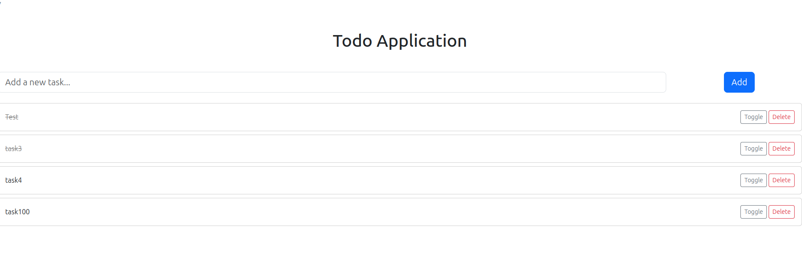
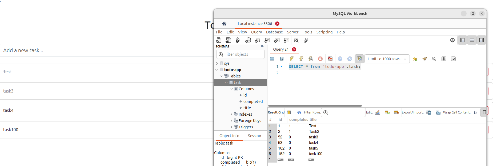

## TODO App 
# What is it about ?
- Made with Maven SpringBoot
  - Use the MySql, PostGreSql and Lombok dependencies 
- Allows the following operations:
  - Add a task
  - Toggle the property "complete" of the task
  - Delete a task

# Screenshots

